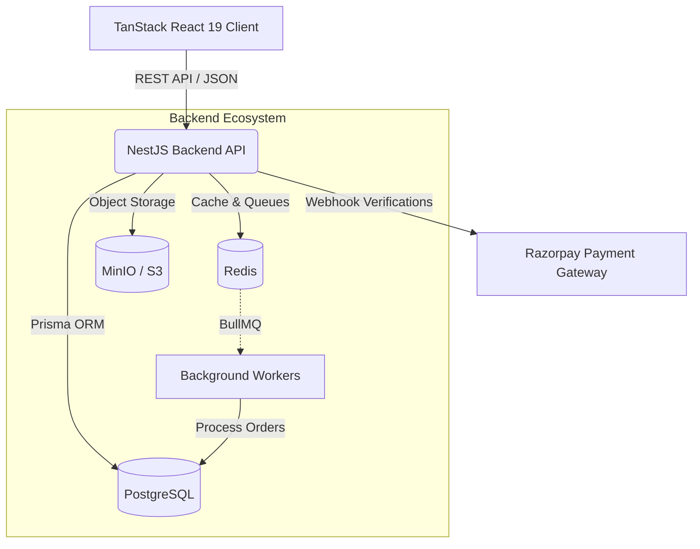

# Aura Streetwear & Ink Studio 🧵

[](https://github.com/AVijit005/fashion-store/actions/workflows/ci.yml)
[](https://nestjs.com/)
[](https://postgresql.org/)
[](https://redis.io/)
[](https://react.dev/)
[](https://www.docker.com/)

> A premium streetwear commerce application, custom print studio, and an internal operating system, designed and built from scratch as a highly scalable, production-grade product ecosystem.

### 🌐 **Live Demo:** [**View Deployed Application on Vercel**](https://fashion-store-itc4ubk6d-avijit005s-projects.vercel.app/)

Aura Streetwear is a modern, full-stack e-commerce architecture demonstrating enterprise-grade engineering practices including **Distributed Caching**, **Row-level Database Locking**, **Webhook Idempotency**, and **Automated CI/CD Pipelines**.


---

## 🏗️ System Architecture

The ecosystem relies on a strict separation of concerns, heavily typed API boundaries, and a robust microservices-inspired persistence layer using **PostgreSQL**, **Redis**, and **MinIO (S3)**.



### 🧠 Senior Engineering Highlights
To ensure 100% data integrity and zero race conditions under high traffic, this project implements advanced backend patterns:
1. **Idempotent Webhooks**: Payment gateways (Razorpay) can send duplicate webhooks. A Redis + Postgres idempotency key system prevents double-charging and ensures orders are only captured once.
2. **Row-level Locking (`SELECT ... FOR UPDATE`)**: During checkout, Prisma locks the specific product variant row in the database. This guarantees that two users cannot simultaneously buy the last remaining stock, preventing negative inventory.
3. **Circuit Breakers**: If the Redis cache fails, the `CartService` seamlessly catches the exception and falls back directly to the primary PostgreSQL database, ensuring 100% checkout uptime even during cache outages.
4. **Soft Deletion & Rollbacks**: The Ink Studio features immutable creator templates. Designs are never truly deleted, allowing users to safely rollback their studio creations without losing historical state.

---

## 🚀 One-Click Orchestration (Docker)

To make it incredibly simple for engineering teams and recruiters to run this application, the entire ecosystem is orchestrated via Docker Compose.

### Prerequisites
- Docker Engine & Docker Compose
- Node.js ≥ 20 (If running without Docker)

### Run the Stack

With a single command, you can spin up the Frontend, Backend, PostgreSQL Database, Redis Cache, and MinIO Object Storage!

```bash
# Clone the repository
git clone https://github.com/AVijit005/fashion-store.git
cd fashion-store

# Spin up the entire infrastructure
docker-compose up -d --build
```

**Services Available At:**
- **Storefront (Frontend):** `http://localhost:8080`
- **Backend API:** `http://localhost:3000`
- **Swagger API Docs:** `http://localhost:3000/docs`
- **MinIO Dashboard:** `http://localhost:9001`

---

## 📖 Interactive API Documentation

The backend enforces strict request validation using `class-validator` and DTOs. 
This allows us to automatically generate interactive Swagger API documentation. 

Once the backend is running, navigate to:
👉 **[http://localhost:3000/docs](http://localhost:3000/docs)**

You can view, test, and authenticate against every single endpoint directly from your browser!

---

## 🛠️ Tech Stack Deep Dive

### Storefront & Admin (Frontend)
- **Framework** — [TanStack Start](https://tanstack.com/start) v1 (React 19)
- **Styling** — Tailwind CSS v4 + Framer Motion
- **State Management** — Zustand (Cart, Wishlist) + TanStack Query (Server State)
- **Forms** — React Hook Form + Zod Validations

### Core Services (Backend)
- **Framework** — [NestJS](https://nestjs.com/) (Express under the hood)
- **Database ORM** — Prisma ORM
- **Authentication** — JWT (Access & Refresh token rotation) + Argon2id Hashing
- **Caching & Queues** — Redis + BullMQ
- **Scheduling** — `@nestjs/schedule` (Automated midnight garbage collection)

### CI/CD & DevOps
- **GitHub Actions** — Fully automated CI pipeline that spins up ephemeral Postgres/Redis containers and runs the Jest E2E test suite on every `main` branch push.
- **Containerization** — Multi-stage Alpine Dockerfiles for maximum efficiency.

---

## 🧪 Testing & Quality Assurance

The backend is hardened with a comprehensive Jest testing suite to prevent regressions.

```bash
# Run Unit Tests
cd backend && npm run test

# Run End-to-End (E2E) Tests
cd backend && npm run test:e2e
```

---

## 📸 Screenshots

| Cinematic Storefront                   | Advanced Interactive Print Studio      |
| -------------------------------------- | -------------------------------------- |
|    | |

| Unified PLP & Cart                     | Custom Internal Admin OS               |
| -------------------------------------- | -------------------------------------- |
|    |  |

---

## 📄 License
MIT — see [LICENSE](LICENSE).

---

## 👨‍💻 Developer & Author

**Vijit**  
*B.Tech CSE Final Year Student & Full-Stack Developer*

This project was built from the ground up as a flagship portfolio piece to demonstrate mastery over modern web architectures, distributed systems, and enterprise-grade backend design. 

- **GitHub:** [@AVijit005](https://github.com/AVijit005)
- **Email:** [Contact me via GitHub](https://github.com/AVijit005) *(or add your email here!)*

<p align="center">
  <i>Built with absolute precision, caffeine, and passion.</i>
</p>
