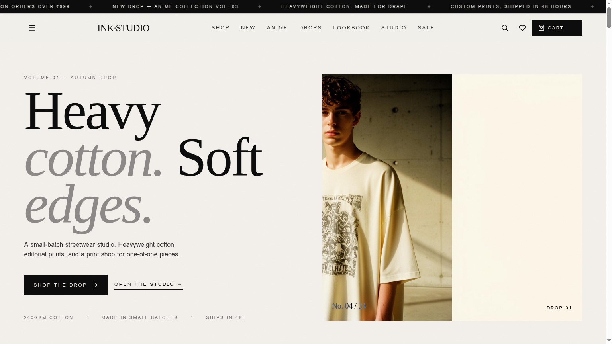
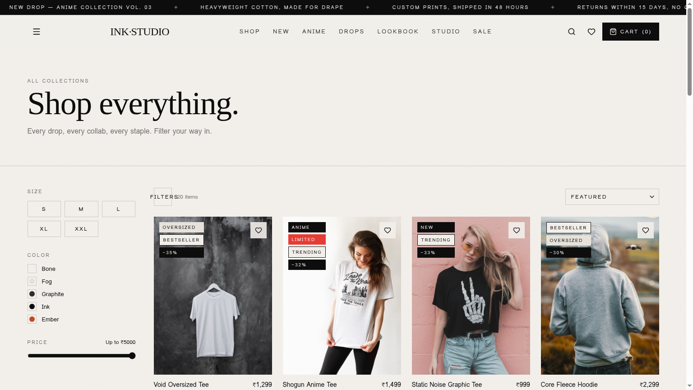
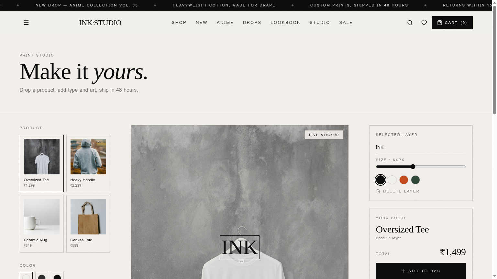
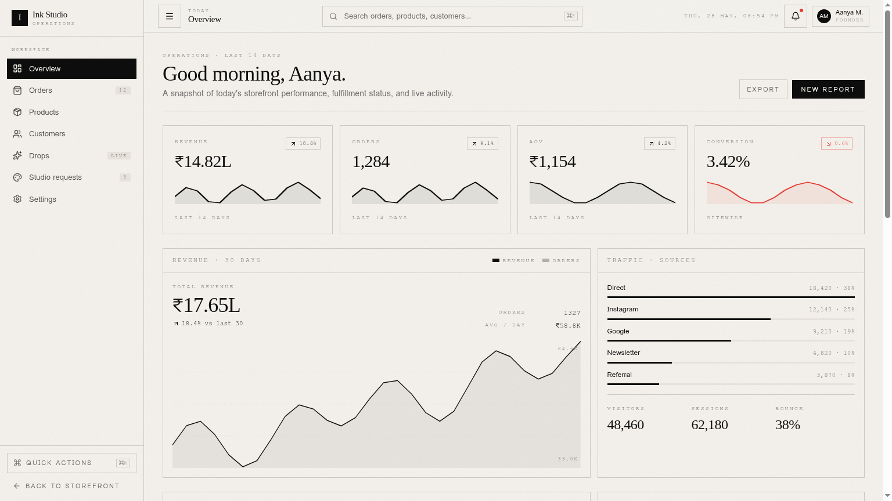
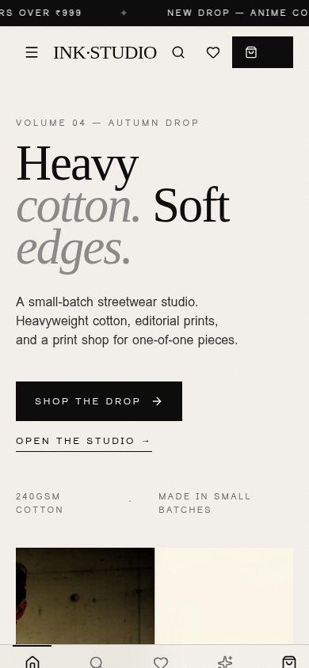

# Aura Streetwear & Ink Studio

> A premium streetwear commerce application — storefront, print studio, and an internal operating system, designed and built as a single, production-grade product ecosystem.

Aura Streetwear is a modern, full-stack e-commerce ecosystem consisting of a highly visual storefront (built with TanStack Start, React 19, and Tailwind CSS v4) and a production-ready backend service (built with NestJS, Prisma, PostgreSQL, Redis, BullMQ, MinIO, and Razorpay).



---

## Highlights

- **Cinematic storefront** — editorial hero, lookbook, drops, anime universe, gift guide, and a full PLP/PDP flow.
- **Print Studio** — interactive product customiser with live mockup, layer controls, colours, and pricing.
- **Admin operating system** — overview, orders, products, customers, drops, studio requests, and settings, all built as a believable internal tool.
- **Unified motion system** — one easing curve, one set of durations, one elevation vocabulary across storefront and admin.
- **Premium restraint** — paper grain, hairline rules, ink-on-paper palette, restrained motion, type-led layouts.
- **Frontend-first architecture** — TanStack Start file-based routing, typed everywhere, zero backend coupling.

---

## Screenshots

| Storefront                           | Shop (PLP)                           |
| ------------------------------------ | ------------------------------------ |
|  |  |

| Print Studio                             | Admin                                  |
| ---------------------------------------- | -------------------------------------- |
|  |  |

<p align="center">
  
</p>

---

## Tech stack

- **Framework** — [TanStack Start](https://tanstack.com/start) v1 (React 19, file-based routing, SSR-ready)
- **Build** — Vite 7
- **Styling** — Tailwind CSS v4 with a token-driven design system in `src/styles.css`
- **UI primitives** — Radix UI via shadcn-style wrappers in `src/components/ui`
- **Motion** — Framer Motion, with shared easing and durations exposed as CSS variables
- **State** — Zustand for cart, wishlist, recently viewed, fly-to-cart, and command palette
- **Data fetching** — TanStack Query (in place for future server integration)
- **Forms & validation** — React Hook Form + Zod
- **Icons** — Lucide

---

## Architecture overview

```
src/
├── components/
│   ├── admin/        # Admin shell, sidebar, topbar, KPI cards, charts
│   ├── cart/         # Cart drawer, free-shipping bar
│   ├── home/         # Hero, drops, lookbook, anime band, trust strip
│   ├── layout/       # Navbar, footer, announcement bar, route transition
│   ├── pdp/          # Gallery, sticky buy bar, reviews, size guide
│   ├── plp/          # Product grid shell, filter sheet
│   ├── product/      # Product card, quick view
│   ├── search/       # Command palette
│   ├── state/        # Empty + loading primitives
│   └── ui/           # shadcn/Radix primitives
├── hooks/            # Reusable hooks (countdown, hydration, mobile)
├── lib/
│   ├── admin/        # Admin fixtures + formatters
│   ├── data/         # Product, category, editorial fixtures
│   ├── store/        # Zustand stores
│   ├── motion.ts     # Shared easing token
│   └── seo.ts        # Per-route head helpers
├── routes/           # File-based routes (TanStack Start)
└── styles.css        # Design tokens, utilities, motion vocabulary
```

The storefront and admin share one design system. Admin routes are nested under `/admin/*` and render inside their own shell (`AdminShell`) without the storefront navbar, footer, cart drawer, or announcement bar — the split happens once in `src/routes/__root.tsx`.

---

## Getting started

This repository contains both the frontend storefront and the backend service. Follow the instructions below to run them locally.

### 💻 Storefront Setup (Frontend)

The frontend is built using TanStack Start and React 19.

#### Prerequisites

- [Bun](https://bun.sh) ≥ 1.1 (recommended) or Node 20+

#### Install & Run

```bash
# Install dependencies
bun install

# Start the dev server
bun run dev
```

The storefront dev server will start at `http://localhost:8080`.

---

### ⚙️ Backend Setup & Docker Infrastructure

The backend is built with NestJS and uses PostgreSQL, Redis, and MinIO.

#### Prerequisites

- Node.js ≥ 20
- npm
- Docker Desktop

#### Install & Run

```bash
# Navigate to backend folder
cd backend

# Install dependencies
npm install

# Setup environment variables
cp .env.example .env

# Spin up Postgres, Redis, and MinIO in Docker
docker-compose up -d

# Run Prisma database migrations and seed data
npx prisma migrate dev
npm run db:seed

# Start the NestJS dev server in watch mode
npm run start:dev
```

The backend server will run at `http://localhost:3000`.
Detailed backend endpoints, testing commands, and environment variables are documented in the [Backend README](file:///d:/aura-streetwear-main/backend/README.md).

---

## 🧪 Testing Commands

Ensure your Docker containers are running before starting backend tests.

- **Frontend Linting:**
  ```bash
  bun run lint
  ```
- **Backend Linting:**
  ```bash
  cd backend && npm run lint
  ```
- **Backend Unit Tests:**
  ```bash
  cd backend && npm run test
  ```
- **Backend E2E Tests:**
  ```bash
  cd backend
  # Windows (PowerShell):
  $env:NODE_OPTIONS="--experimental-vm-modules"; npm run test:e2e
  # macOS/Linux:
  NODE_OPTIONS="--experimental-vm-modules" npm run test:e2e
  ```

---

## 📦 Production Deployment

- **Frontend:** The build output is a static + edge-rendered TanStack Start bundle that deploys cleanly to Vercel, Netlify, or Cloudflare Pages.
  ```bash
  bun run build
  ```
- **Backend:** A multi-stage `Dockerfile` is provided in the `backend/` directory to build a lightweight production container. Managed database (PostgreSQL), Redis cluster, and AWS S3/Cloudflare R2 buckets are required. See the [Backend README](file:///d:/aura-streetwear-main/backend/README.md) for environment variables.

---

## 🗺️ Project Architecture & Roadmap

This project is now fully integrated. The following components are 100% complete and verified:

- [x] **Storefront & Print Studio Frontend** (TanStack Start, Tailwind CSS v4, Framer Motion)
- [x] **NestJS Backend Architecture & Config Validation** (Zod environment parsing, global filters, Winston logger)
- [x] **Identity & Access Management** (Argon2id password hashing, JWT access/refresh token rotation, and guards)
- [x] **Catalog & Native PostgreSQL Search** (Weighted vector search, trigram similarity relevance, and GIN indices)
- [x] **Checkout, Concurrency & Payment Lifecycle** (Razorpay integration, stock reservations, webhook verification, and idempotency)
- [x] **Studio Ecosystem Backend** (Soft-delete designs, version history rollbacks, immutable creator templates, S3 object storage)

---

## Credits & inspirations

Design language draws from editorial fashion publications, small-batch heavyweight labels, and the restrained operational tools made by modern DTC teams. Product imagery is placeholder content sourced from open photography libraries for demonstration purposes only.

Built with [Lovable](https://lovable.dev).

---

## License

MIT — see [LICENSE](LICENSE).
